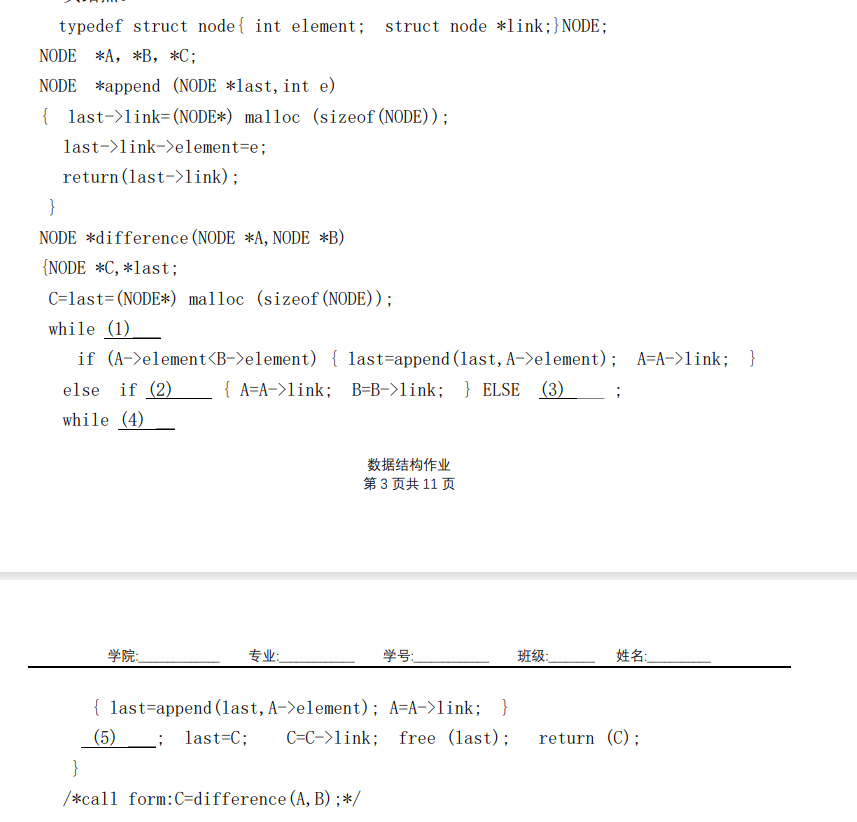

## 2026年6月14日 星期日

由于发现原有的日记全部堆在一个html文件中，太过于屎山并且出现了无法正常渲染的bug，遂借用DeepSeek之力将日记重构为md渲染，以后写日记起码不需要敲html了。

## 2026年6月8日 星期一

脱了n个月的auto-pull终于给服务器加上了，现在可以通过git中转的方式自动把git内容拉取到服务器上。静态页面即可更新为最新内容。

该日记即为测试文本 。

## 2026年4月9日 星期四

进组日记第一天（其实现在是半夜十二点），由于导师昨天才联系上，而4月10号就是申报表的截止日期了，所以只能熬夜赶工。项目组三个软工，一个计科的我，两男两女。

选题做了恶劣天气条件下基于计算机视觉的车辆目标检测系统，但是大家好像对计算机视觉这方面都是完全不会的状态，得从头开始学，想想就头大啊！

## 2026年2月28日 星期六

为什么二月一整个月都没写日记，那是因为月初被自己闲着没事搞的那个动态博客弄的心力交瘁，实在是没精力做原来这个页面了。要我说还是原来这个简简单单的静态页面方便。在ide里面直接写日记有什么不好的？

最近氪金做了点新产品哈，是局域网文件传输，待会贴到产品页面去。

## 2026年1月21日 星期三

今天终于把前几门恶心的课给考完了，大物竟然考的都会，只是概率论出成绩，坠机了。

明天GTM8+ 11:00明日方舟终末地开服，期待中......

## 2026年1月16日 星期五

我恨计算机系统基础2。我恨数据结构。来自考试前深夜的怒吼。本来分配五天时间准备一半学csapp另一半学数据结构的，结果光复习csapp的ppt就用掉了四天的时间。数据结构还有那么多贼几把长的纸面作业要写，考完数据结构还要复习英语和大物，谁他妈有功夫写你那纸面作业啊，我能凑合着给你写写算法题就不错了，他妈的又臭又长。去死吧去死去死去死！

## 2026年1月1日 星期四

2026新年快乐！也是终于熬到copilot免费额度刷新的时候了。上个月月初用掉了太多额度来做那个没用的网页。最近也是到期末复习的阶段了，也是十多天没修理过这个网页了，买了服务器之后也没怎么在意把这个网页部署上去，在那个服务器里部署了原版mc，却因为内存太少总是闪退，于是服务器已经连续很多天处于一个闲置的状态。有时间要搞一个普通tcp协议的小程序玩玩。

## 2025年12月20日 星期六

自从把服务器的镜像换成ubuntu之后，我突然就感受到linux系统命令行操作的美感了。宝塔面板又缓解了linux系统查看文件结构不方便的难题，而且宝塔面板的命令行是用8888端口直连的，不会像ssh那样占用大量资源。我真的要爱上linux系统了。

## 2025年12月18日 星期四

前几天在华为云捡漏买了个36块钱一年的服务器，本来准备建网站的。之前在腾讯云买了俩域名，fxhook.fun和fxhook.cn，fun的域名重定向到现在这个github页面了，原本我是打算给fxhook.cn备案然后在服务器建网站的，但是备案信息不充分，今天给我打电话说备案失败了，所以我就在建了一个原版mc服，反正游戏ip不需要备案也能正常使用。也是知道了linux系统里面screen这个用法，让程序在后台跑，不会因为关掉shell就终止了程序。

## 2025年12月13日 星期六

今天考完六级了，我觉得我又行了。

听取了TranceDream的建议，压缩了音频质量和图片，对背景图片采取了分段加载的形式，提高了加载速度。

## 2025年12月12日 星期五

明天就要考六级了，心情特别紧张。这几天虽然有在复习，但总感觉还有很多内容没掌握。特别是听力部分，总是跟不上节奏。希望明天能发挥出自己的水平，顺利通过考试。

## 2025年12月9日 星期二

今晚上在图书馆研究了好几个小时的拓扑排序和AOE网络，我记得老师也没讲过AOE相关的内容啊，这代码那么长根本学不会。回宿舍吃柚子，苦了吧唧的。今晚又没听六级听力，要是明天早晨起早点说不定来得及再听一套。周六上午在化工学院考六级，很奇怪哈，为啥是在化工学院考试啊，难道是因为他们有大教室吗？

今天晚上用ai做那个AOE的演示网页，他总也做不对，结果就是一晚上把额度从20%用到了50%。只能说最新的这个claude opt 4.5这个3×的额度实在是太高了，但是他确实有水平的，明显能看出来比国产模型或者gpt聪明。

## 2025年12月5日 星期五

用ai制作了一个炫酷主页。在电脑上看起来还好，在手机上运行的时候掉帧很严重。只能用作展示。

## 2025年12月3日 星期三

我今天突发奇想使用了GitHub的代码空间，代码空间可以创造一个在线的 VS Code，于是我便可以使用平板电脑进行编程了。然而这个该死的在线网页似乎完全不适配平板的鼠标操作，界面缩放也很难受，浏览器的导航栏缩不回去。

## 2025年11月16日 星期日

今天一天用ai做了个聊天网站。自己也不会python，纯用ai搓出来的一个服务端一个桥接服务器。具体遇到的难题是：我的内网穿透只能用tcp协议，而我的网站只是一个静态网站，无法转发内容。ai一开始总是在tcp协议和http协议之间纠结，因为网页是用了一个websocket协议，这个协议只有http/https协议支持。所以我想出来让ai做一个proxy，把网页的http协议转发成tcp协议再发到我这边来。

## 2025年11月11日 星期二

最近在看村田的一拳超人重置版，不得不说村田真是耐改王，一话能改两遍。

## 2025年11月3日 星期一

今天在写数据结构的作业,其中包含题目如下图。从大一学程序设计基础的时候就想吐槽了,卷面上印的代码怎么都不像是给人看的,缩进做的跟狗屎一样。

  

    
  

刚刚用了copilot的Agent模式帮我重构了网站的目录结构，他功能真是强大，直接用命令行解决绝大部分难题。

## 2025年11月1日 星期六

28号我换了新手表华为 watch fit4，感觉新手表的屏幕以及许多功能都比原来的好，而且价格是比之前的手表低了不少，那个破手表沾了水就漏电，上课把我吓的直接把手表扔地上了。买新手表在店家选的以旧换新，或许能给我抵100多块钱。

今天下午体测，各方面都还行，肺活量甚至吹到4900+，比去年多了九百多。最近天天练引体，下雨天打滑也照样练，过两天测引体向上的时候还有镁粉，我真就能好好装逼了。

## 2025年10月26日 星期日

早晨起来发现手表的心率监测灯坏掉了，以为是昨晚上坏的，结果查了一下手机的数据记录，结果24号凌晨的时候手表就坏了，，网上说华为修这个手表得花400~600块，我这表就1k买的真的值得我花那么多钱去修吗？

## 2025年10月23日 星期四

没想到买的硅脂是从老家发货发过来的，想了想可能是因为上次想要物流快一点就直接选了离家最近的那个店。

今天拿到硅脂之后给电脑拆开，结果散热器螺丝拧不下来，去电脑店找人帮忙才拧下来。电脑店的阿姨看我电池都拆下来了，警告我说这个天选5那个电池卡扣很危险，应该先拔下那个来，否则很容易击穿主板...万幸电脑最后没坏。

重新涂了硅脂之后温度竟然没什么变化，看来散热效果并没有我想象中那么好。

## 2025年10月21日 星期二

前天看了一个来自北京郊区的大学生对自己经历教育的讲述视频，感触很大。

看了视频之后我开始思索自己经历过的教育和各种事情，想要写成一个类似的回忆录。

可惜参考文献（指我高中的日记）放在家里，有些事情可能不记得了还得查询日记。

## 2025年10月15日 星期三

TranceDream先生帮我把图片上传到了cdn，加快了网站的图片加载速度。

终于突破了一个伸直胳膊的引体向上，可喜可贺。

## 2025年10月12日 星期一

今天换了背景音乐，又放了一堆魔审图片。

背景音乐考虑弄个多首歌循环播放。真的好喜欢危机合约这几首歌。

## 2025年10月6日 星期一

早晨给个人网页放了背景图片。

国庆待在家里的最后一天，明天就回学校了。并没有感觉到什么不舍，因为这次回家时带的行李箱几乎是空的，这次回学校可以把家里的显示器塞到行李箱里面带到学校去。当时还担心学校桌子可能放不下这么大的显示器，其实是多虑了。后来在北洋维基上查到桌子隔板之下的高度是43厘米，我自己家桌子的高度也是43厘米略多一点，看样子不用担心放不下了。

## 2025年10月5日 星期日

好不容易放个国庆节假，结果回家之后就开始发烧，二号下午去打的吊瓶，结果到今天还在是懒散虚弱。真是受够了......

## 2025年10月5日 星期日

今天完成了个人网站的建设，添加了日记页面。这个页面右侧有一个万年历，可以查看日期。

最近在B站上发布了新的视频，关于明日方舟和Ave Mujica的联动内容，无人观看。

## 2025年9月5日 星期五

做了个赤石视频睦子米的人格大逃杀，虽然没人看，但玩得很开心。

计划在接下来的时间里更新更多的网站内容，包括日记功能。

## 2025年7月5日 星期二

随便学了点html语言，然后胡乱做了个网页，甚至是用的添加文件放到Github上。不会用git push可还行。

觉得太丑了，遂使用ai进行美化。
